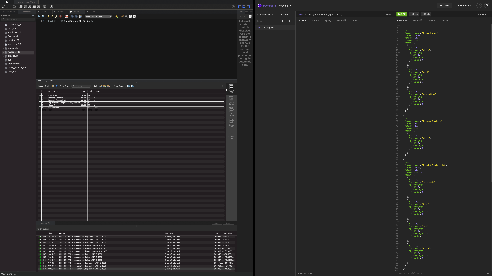

# E-Commerce Back End

## Description

This a back end for an e-commerce website that uses all of the latest technologies. Users can use Insomnia Core and MySQL to GET, POST, UPDATE, and DELETE products, tags, and categories.

## Table of Contents

- [Installation](#installation)
- [Usage](#usage)
- [License](#license)
- [Contributing](#contributing)
- [Tests](#tests)
- [Questions](#questions)

## Installation

To install necessary dependencies, run the following command:

> npm i 

## Tests

To run tests, run the following command:

> npm test 

## Usage

Express, Dotenv, Sequelize and MySQL2 are required to run this application.

Users can seed a new database with information provided. Once seeded, they can start the application and use Insomnia Core (or other software) to GET, POST, UPDATE, and DELETE products, tags, and categories.

## Link

Click the following link to view a walkthrough of the application: https://drive.google.com/file/d/1P4QtWsg7BTsrz8yLQREyfODqkeyUSmAY/view

## License

This application is covered under the following license: None

## Contributing

Feel free to contribute!

## Questions

Have questions? Contact this project's creator at ryanascherr@gmail.com.

Their GitHub profile page is https://github.com/ryanascherr.

